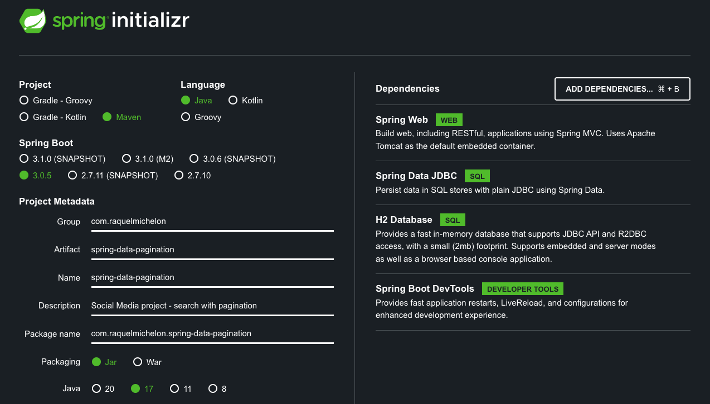

<h1 align="center"> Pagination Mini-Project </h1>

Web Service for Social Media posts search with pagination support using Spring Boot and Sring Data JDBC  

  <a href="#-setup">Setup</a>&nbsp;&nbsp;&nbsp;|&nbsp;&nbsp;&nbsp;
  <a href="#-technologies">Technologies</a>&nbsp;&nbsp;&nbsp;|&nbsp;&nbsp;&nbsp;
  <a href="#-project">Project</a>&nbsp;&nbsp;&nbsp;|&nbsp;&nbsp;&nbsp;
  <a href="#-acknowledgment">Acknowledgment</a>&nbsp;&nbsp;&nbsp;|&nbsp;&nbsp;&nbsp;
  <a href="#memo-licença">License</a>

  

 

> Note! This project is a working in progress

 

## 🚧 Setup

Project started via Spring initializer with the following configurations:

## 🚀 Technologies

- Java 
- Maven
- Spring Boot
- Spring Data JDBC
- H2 database
- Spring Testing

## 💻 Project

This is a web service which list user posts in a paginated way.

### Steps:

1 - create a Record to represent the Post model/entity;

2 - implement the PostRepository to search for post that should extends PagingAndSortingRepository;

3 - create the service layer to list the pageable posts

4 - create the controller to work with http requests

5 - implement an automatized test

## ♡ Acknowledgment

This project was possible thanks to [Giuliana Bezerra](https://github.com/giuliana-bezerra/tutorial-springdata-pagination) who originally created and prepared the following [tutorial](https://www.youtube.com/watch?v=Jrhb5YJK5II&list=PLiFLtuN04BS30iQ51gOtKWnrKUPgDSqHq). 

## :memo: Licença

This project has the MIT license.

---

⌨️ Developed by [Raquel Michelon](https://github.com/RaquelMichelon)

